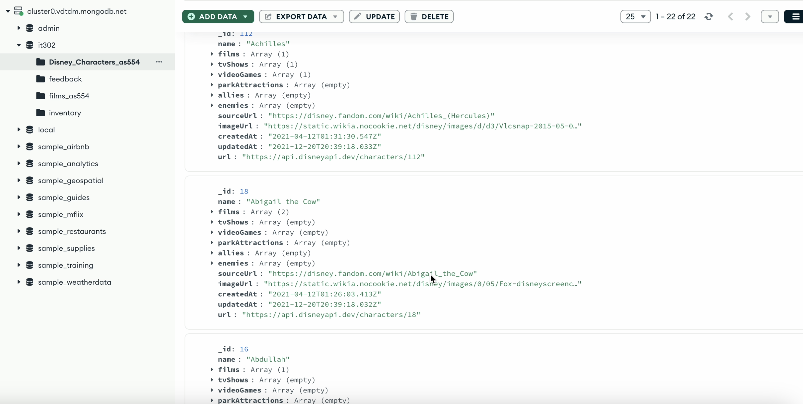
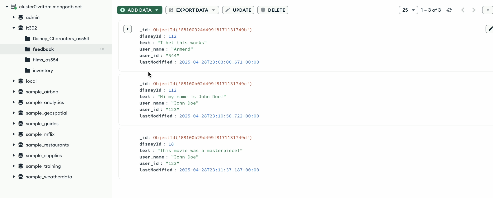
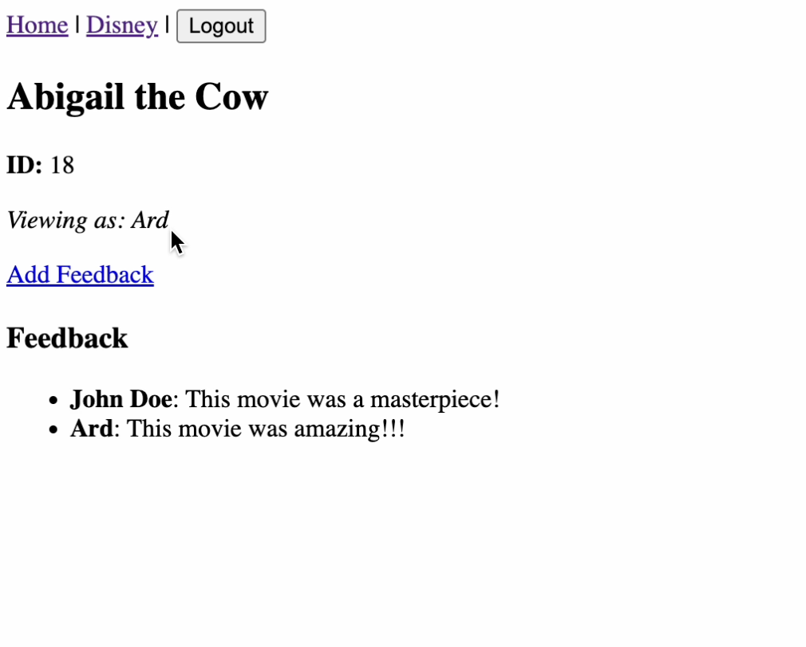
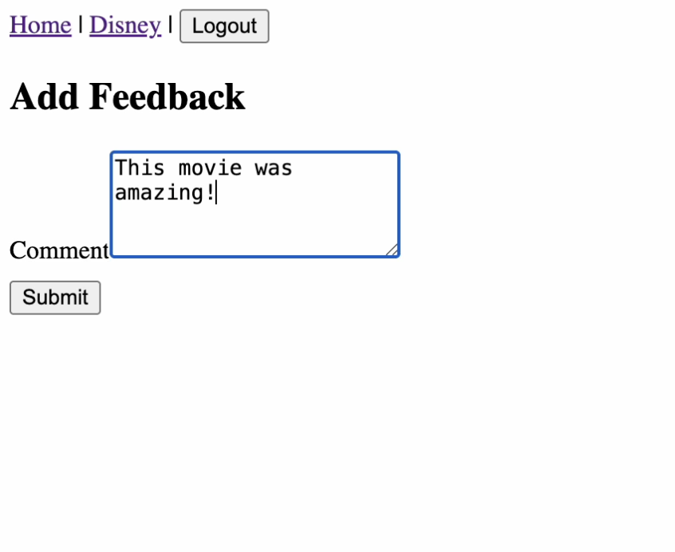

Disney-MERN
A full-stack web application that allows users to browse and leave feedback on Disney movie characters using a MongoDB dataset. Built with the MERN stack (MongoDB, Express.js, React.js, Node.js), this project demonstrates dynamic data interactions, modern React routing, and asynchronous data fetching with minimal styling.

Overview
This application is a movie analysis platform where users can:
    - View a list of Disney characters sourced from a MongoDB database.
    - View detailed info about a character including films, games, TV shows, and metadata.
    - Log in as a user (no authentication layer; any login name will work).
    - Submit feedback/comments per character.
    - View feedback left by other users for each character.

Tech Stack

Frontend
- React.js: Component-based UI
- React Router DOM: SPA routing
- AJAX + Fetch API: Data fetching
- SON: Data transfer format
- Minimal CSS: No design libraries; mostly unstyled for functionality focus

Backend
- Node.js: Server-side runtime
- Express.js: RESTful API routes
- MongoDB Atlas: Cloud-based NoSQL database
- Mongoose (or native driver): MongoDB interaction

Features
- Disney Character Listing: Fetches and displays data from the Disney_Characters_as554 MongoDB collection
- Character Detail View: Show image, bio info, and related metadata from API
- Search Functionality: Real-time filtering by name
- Feedback Submission: Submit and view feedback per character
- Login State: Maintains user session with simple state variable (no auth/authorization)
- Persistent Storage: Feedback is stored and read from the feedback MongoDB collection

Skills & Concepts Demonstrated
- Full-stack JavaScript development
- RESTful API architecture
- MongoDB document modeling
- React component design and props/state usage
- Routing with React Router (including dynamic routing)
- Form handling and controlled components
- Asynchronous JavaScript (async/await, fetch)
- CRUD operations with Express and MongoDB
- Project structure for frontend/backend separation

NOTES
This project is focused on functionality and MERN integration, not UI/UX design.
There is no authentication or authorization; login is simulated for demo purposes.
The MongoDB data used is based on Disney character records from the Disney API (linked in each entry).

Installation for Local Testing:
git clone https://github.com/ArmendSin/disney-mern.git
cd disney-mern
cd backend && npm install && npm run dev
cd ../frontend && npm install && npm start

Screenshots
MongoDB:
Disney Characters

Feeback

Application:
Disney Homepage Records

Character Feedback

Insert Feedback

